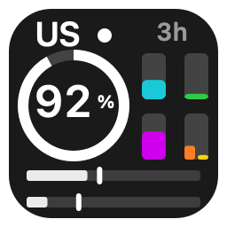
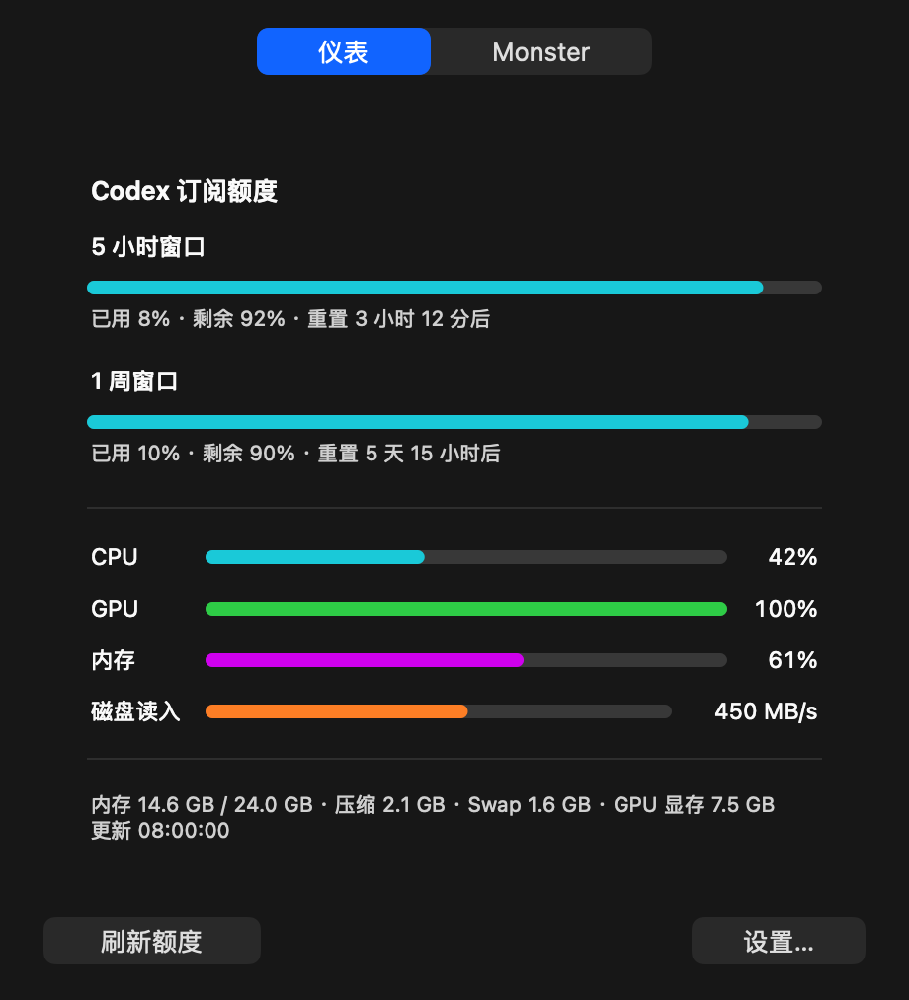
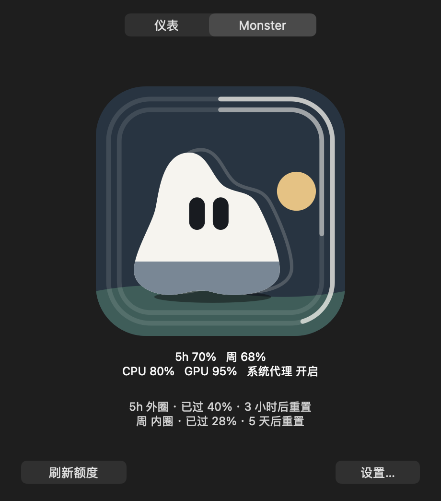
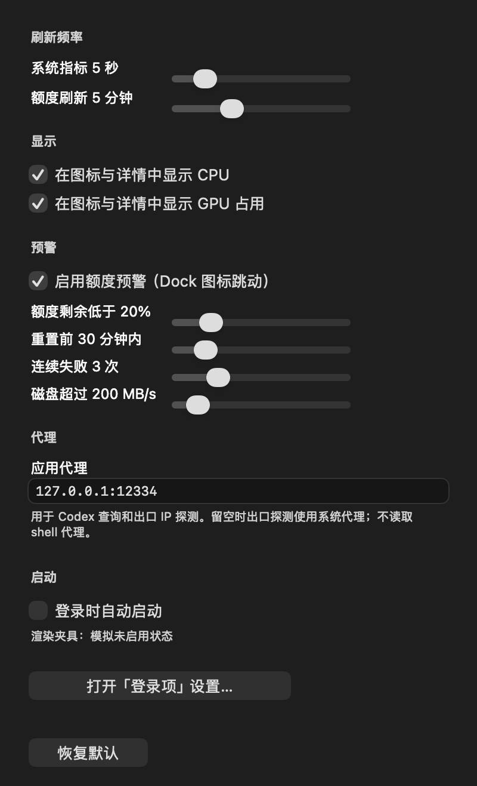
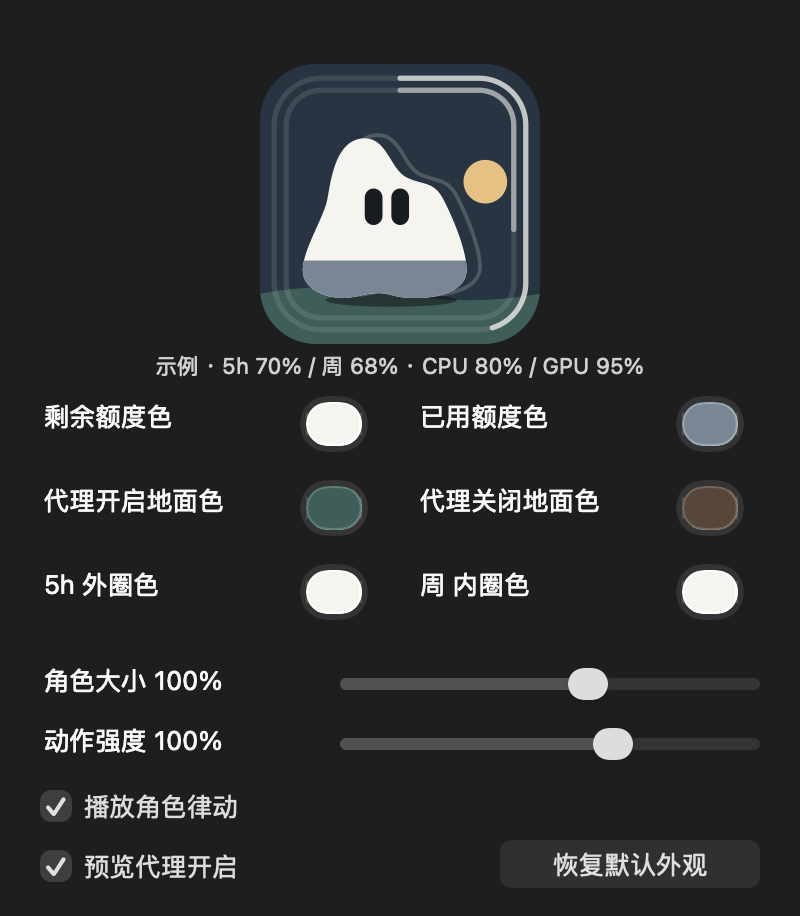

<p align="center"></p>
<h1 align="center">Monster Pulse · 怪兽脉搏</h1>
<p align="center">把 Codex 剩余额度和 Mac 的忙闲，放在 Dock 上。</p>
<p align="center">macOS 13+ · Swift + AppKit · 无第三方运行时依赖<br><a href="LICENSE">代码：MIT</a> · <a href="NOTICE.md">怪兽形象：保留版权</a></p>

一个常驻 macOS Dock 的小工具：显示 Codex 订阅额度、CPU / GPU / 内存 / 磁盘读写和网络出口，点击图标查看详情，关闭窗口后继续运行。

这是一个个人练手项目，按自己的使用习惯慢慢打磨。有用就拿去用，欢迎提 Issue 或 PR。它不是 OpenAI 官方产品，也不承诺支持所有设备和未来的 Codex CLI 版本。

## 预览

<p align="center"> &nbsp; </p>

截图使用固定示例数据。未启动时显示灰白怪兽，两层渐淡轮廓表达 Pulse；运行时可在「仪表 / Monster」之间切换，每次启动默认显示仪表。

<p align="center"> &nbsp; </p>

## 功能

- **剩余额度**：数字与圆环显示 Codex 主额度窗口的剩余百分比，附重置倒计时；详情展示各额度窗口。
- **消耗节奏**：底部额度轨对比已用额度和已过时间。
- **系统负载**：Dock 以 2×2 显示 CPU / GPU / 内存 / 磁盘，设置可独立隐藏四项，剩余柱状图自动扩展填满计量区。磁盘左橙读、右黄写，满格为 800 MB/s；详情还有压缩内存、Swap 与磁盘读入速率。
- **网络出口**：显示探测出口的国家代码和代理状态，Dock 右键菜单提供更多信息。
- **Monster 视图**：角色白色面积表示 5 小时剩余额度，太阳高度表示周剩余额度；地面默认青绿为系统代理开启、暖棕为关闭、中灰为未知。CPU 上下律动、GPU 横向伸缩，隐藏对应指标后停止该动作。内存与磁盘继续在仪表中展示。
- **Monster 时间双环**：外圈为 5 小时时间、内圈为周时间，两个完整圆角环从顶部顺时针增长，亮段表示窗口已过比例。环线向内留白，避免 Dock 四角裁切。主窗口显示各窗口的时间比例与重置倒计时；时间未知只画暗轨，到期显示等待刷新。
- **外观配置**：设置底部「Monster 外观…」可调整额度色、代理地面色、5h 外圈色与周内圈色、角色大小（85–110%）、动作强度（0–150%）及动画开关，即时生效并保存；支持恢复默认外观。
- **本机设置**：调整采样与刷新间隔、应用代理、额度预警和开机自启。预警通过 Dock 图标跳动提示。
- **异常状态**：查询失败时保留最后快照并标记过期状态，不用模拟数据冒充实际结果。

## 安装与运行

需要 **macOS 13+** 和 **Xcode Command Line Tools**。读取额度另需支持 `app-server` 的 Codex CLI，并以 ChatGPT 订阅账户登录；仅使用 API Key 的账户不在项目的目标范围内。

目前没有预编译发行包，直接从源码构建：

```sh
git clone https://github.com/usoluyun/monster-pulse.git
cd monster-pulse

# 未安装 Apple 命令行工具时执行
xcode-select --install

# 确认 Codex CLI 已安装并登录
codex login status

# 构建、本机签名和自检
bash app/build.sh --sign
app/.build/MonsterPulse.app/Contents/MacOS/MonsterPulse --self-test

# 安装后从 Finder / Dock 启动
bash app/install.sh
open /Applications/MonsterPulse.app
```

更新前先退出应用，再重新构建、安装。安装脚本会刷新应用包日期并重新登记系统图标，避免 Dock / 启动台继续显示旧缓存。安装需要目标目录的写入权限。

也可以直接运行 `open app/.build/MonsterPulse.app`。点击 Dock 图标打开主窗口，顶部「仪表 / Monster」同时切换主界面与 Dock；每次启动默认显示仪表。Dock 右键菜单也可切换模式或开关角色律动，律动默认开启。仪表显示详细数值。点击主界面右下角「设置…」或按 `⌘,` 打开设置，`⌘Q` 退出。

### 代理与网络

从 Finder / Dock 启动不会继承终端代理环境。需要代理时，请在设置中的「应用代理」填写地址，如 `http://127.0.0.1:7890`；它用于 Codex 查询和出口探测。留空时，出口探测使用系统代理设置。

出口探测请求 Cloudflare 的 `/cdn-cgi/trace`，获取 IP 和国家；它只代表这次请求的出口。PAC、分流或 VPN 下，其他网站可能走不同线路，系统代理开关也不代表所有流量都经过代理。

设置保存在本机 UserDefaults。当前版本没有自建后端或应用遥测；Codex 查询通过本机 CLI 完成，其认证与日志由 CLI 管理。真机性能指标上报仅列入远期里程碑 M5，尚未实现。

<details>
<summary>设置面板预览</summary>

<p></p>

<p></p>

</details>

## 开发与验证

源码集中在 `app/Sources/`，领域层与 UI 分离，不需要 Xcode 工程或包管理器。

| 文件 | 职责 |
| --- | --- |
| `Metrics.swift` | 额度解析、Codex 子进程查询与系统采样 |
| `Network.swift` | 代理选择、出口探测与网络数据解析 |
| `Alerts.swift` | 预警规则与去重 |
| `Config.swift` | 本机配置与设置窗口 |
| `DetailsView.swift` | 详情窗口 |
| `MonsterModel.swift` | 角色轮廓、按面积求额度分界、外观配置校验（不依赖 AppKit） |
| `MonsterView.swift` | 主窗口与 Dock 共用的角色绘制、外观面板 |
| `main.swift` | 应用生命周期、Dock 绘制与测试入口 |

```sh
bash app/build.sh --sign
app/.build/MonsterPulse.app/Contents/MacOS/MonsterPulse --self-test
bash app/tests/render-regress.sh
bash app/tests/run-abnormal-tests.sh
bash app/tests/run-termination-tests.sh
```

渲染回归需要 Python 3。自检不联网，使用独立的测试配置域；渲染夹具使用固定数据，不修改真实设置。修改 UI 后也请实际看图，并从 Finder / Dock 验证真实窗口。详细规范见 [AGENTS.md](AGENTS.md)。

修改图标后运行 `bash app/generate-icon.sh` 生成 `.icns`；仅这一步需要 librsvg 的 `rsvg-convert`。常规构建直接使用仓库内的图标。

## 已知限制

- GPU 采样使用 IOKit 中未文档化的统计字段，兼容性无法保证；读取失败时显示不可用。
- 内存是页面统计的估算值，不等于活动监视器的「内存压力」；磁盘读入统计也不是全量磁盘 I/O。
- 依赖 Codex CLI 的 `app-server` 协议，登录状态、网络连接和协议变化可能影响额度查询。
- 默认每 5 秒采样系统指标、每 5 分钟查询额度。Monster 动画以最多 10 fps 表现最近一次采样，并不提高采样频率；关闭动画、动作强度为 0 或系统启用降低动态效果时停止负载动画。
- Monster 当前映射 Codex 的 300 分钟 / 10080 分钟窗口；来源缺少这些窗口时显示未知标记，旧快照显示「旧」。其他用量来源尚未接入。
- 小尺寸 Dock 有可读性限制。系统通知未启用，预警使用 Dock 跳动。
- `--sign` 为 ad-hoc 签名，未做 Apple 公证。本机已验证开机自启；其他设备仍需自行验证。

## 文档与贡献

- [项目里程碑](docs/roadmap.md)：M1 已完成，M2 原生功能已实现、验收中；M3 / M4 规划用量来源，M5 规划真机性能指标上报。
- [Monster 设计与使用](docs/monster-view-design.md)
- [Monster 资源用量记录（2026-10-08）](docs/resource-usage-2026-10-08.md)：单机 Monster 动画 15 分钟 CPU / footprint 采样及其验收限制。
- [文档入口](docs/README.md)
- [设计与数据来源](docs/codex-dock-feasibility.md)
- [构建、打包与测试](docs/poc-usage.md)
- [阶段性验证记录](docs/codex-dock-verification.md)

部分文档保留早期 `CodexDock` 的名称和历史测量结果，当前功能以源码和本 README 为准。

欢迎小而具体的改进。提 Issue 时请附 macOS / 芯片型号、Codex CLI 版本、复现步骤及脱敏后的错误信息；提交代码前运行相关检查，UI 修改请附截图。

## 许可与形象版权

**代码与文档采用 [MIT License](LICENSE)，怪兽形象不在 MIT 授权范围内。**

「未定体」角色、其灰白改色与轮廓回声变体，以及 `app/Resources/AppIcon.svg`、`AppIcon.icns`，版权归原著作权人所有，保留所有权利。公开代码不代表开放形象版权；版权范围与使用限制见 [NOTICE.md](NOTICE.md) 和 [素材版权声明](app/Resources/LICENSE.txt)。
